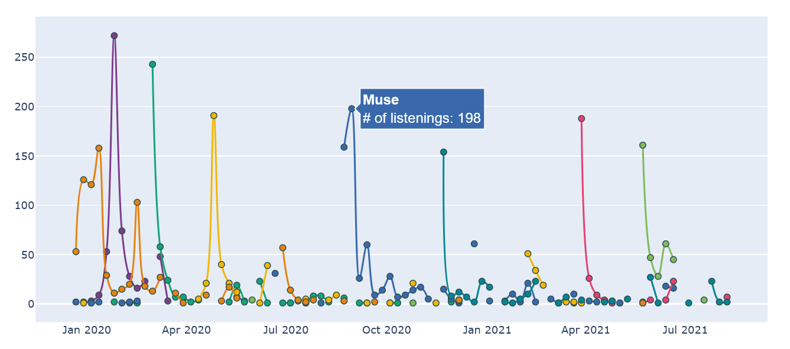

# Spotify notebooks

Here are visualisations of personal listening habits in Spotify, in a form of Jupyter notebooks.

## Instructions

1. download your listening data from Spotify ([link](https://www.spotify.com/us/account/privacy/))
2. install Jupyter
3. pick a notebook from this repo and download it
4. review settings at the top of the notebook and run all cells. 

## Examples of graphs

